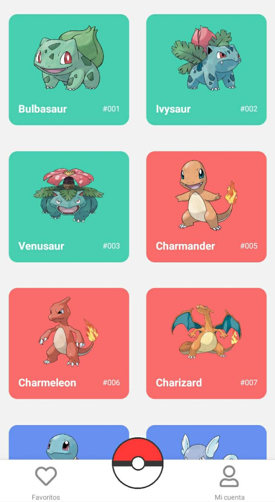
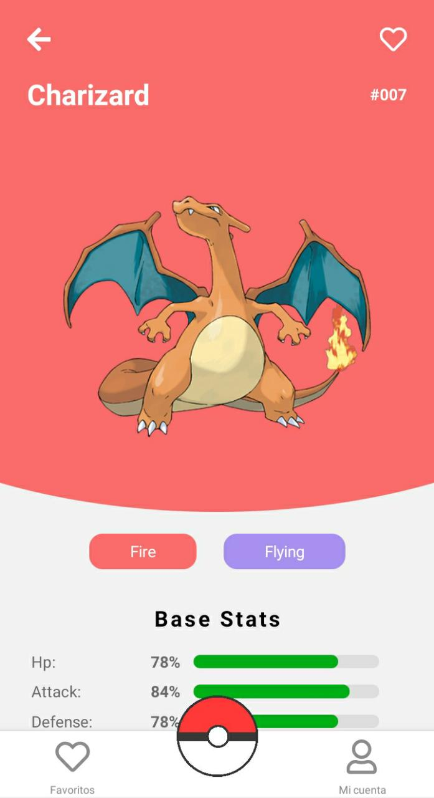
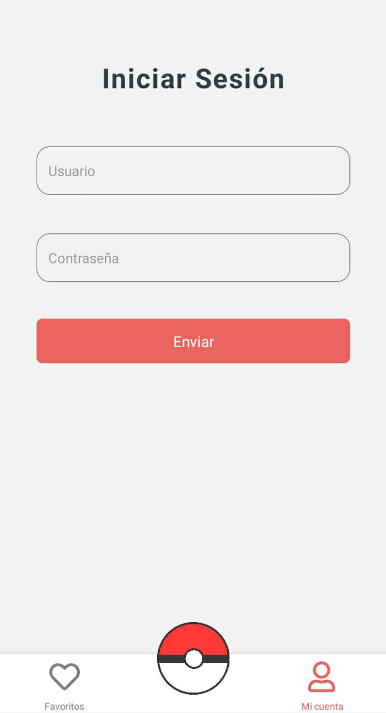
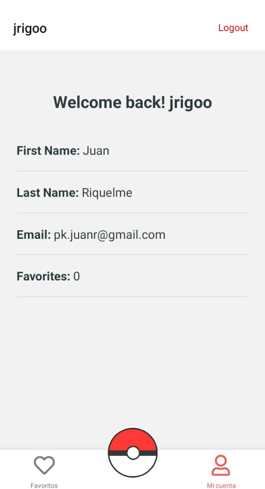
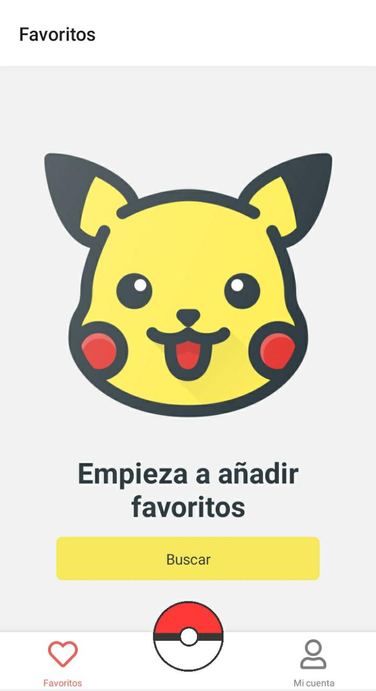

# **Pokedex**

React Native typescript proyect using Expo and the [Pokemon](https://pokeapi.co/) RESTful API

    
    
    
    
    
    

### **Functionality**

- You can watch pokemons, and see their details.
- You can add pokemons to favorites
- You can login/logout (Delete favorites)
- You can see your account and quantity of favorites

### **Tools**

- To add pokemon as favorites it uses _@react-native-async-storage/async-storage_ package (Like localStorage on the browser).
- The navigation is made using **react-navigation** (Stack and Bottom-tab)
- Simple auth system, doesn't use backend but simulates asynchronous API calls. So if you want to add another user go to _src/utils/userDB.ts_ and modify **USER** object
